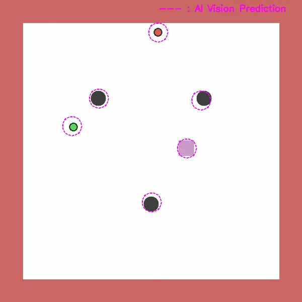
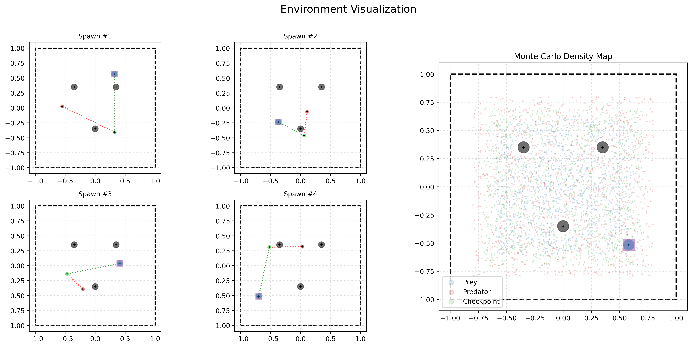
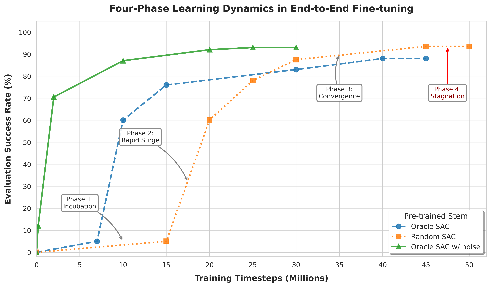

# End-to-End RL for Predator-Prey: A Vision-Based SAC Baseline

<p align="center">
  
</p>

<p align="center">
  
  
  
  
</p>

## 📌 Overview
This repository implements an **end-to-end continuous control baseline** for a single-agent Predator-Prey (Simple Tag) environment. The prey is controlled by an underlying RL policy operating purely on visual image inputs.

The training framework features a **staged pipeline**:
1.  **State Oracle Pre-training:** A Soft Actor-Critic (SAC) policy is trained on ground-truth states, utilizing Curriculum Learning to overcome sparse rewards.
2.  **Vision Backbone Pre-training:** A vision backbone is trained in a supervised manner using environment-generated data to extract entity coordinates.
3.  **Direct Visual E2E Fine-tuning:** The pre-trained SAC MLP is stitched with the pre-trained Vision Backbone, fine-tuning the entire visuomotor architecture end-to-end.

## ✨ Key Features

* **Parallel Training Architecture:** Leverages the Stable-Baselines3 framework for scalable multi-processing, ensuring independent environment resets to maximize sample throughput.
* **Staged End-to-End Pipeline:** Pre-trains an oracle policy to rapidly verify the core algorithm before facilitating a smoother visual domain adaptation.
* **Comprehensive Toolsets:** Includes out-of-the-box scripts for trajectory visualization, dataset auditing, and rigorous checkpoint evaluation.
* **Rich Empirical Observations:** Features deep dive analyses into fascinating training phenomena, including how domain randomization accelerates E2E adaptation, and how agents develop (and sometimes forget) complex deceptive maneuvers.


## 💻 Setup & Reproduction
#### 📂 Project Structure
```python
predator-prey-e2e-rl/
 ├── src/                 # Main training and evaluation recipes
 │   ├── e2e/             # End-to-End fine-tuning scripts
 │   ├── env/             # Wrappers for customizing speed, rewards, state space, etc.
 │   ├── notebooks/       # Jupyter notebooks for visualization and data auditing
 │   ├── oracle/          # State-based oracle policy training
 │   └── vision/          # Supervised learning scripts for the vision backbone
 ├── logs/                # TensorBoard log directory
 ├── outputs/             # Saved checkpoints, generated datasets, and render videos
 └── multiagent-envs/     # Dependency: Core physical simulator & Simple-Tag scenario

```

*Note: Before initiating any training runs in `src/`, it is highly recommended to inspect the source code and adjust hyperparameters (e.g., `input/output_path`, `num_epochs`, `learning_rate`) to fit your specific setup.*

#### 🛠️ Environment Installation
#### Env install
It is strongly suggested to start with a fresh virtual environment.
For example, using Conda:

```bash
conda create -n gym_RL python=3.13 pip
conda activate gym_RL
```

Next, install PyTorch. Please visit the [PyTorch Get Started Page](https://pytorch.org/get-started/previous-versions/) to choose the command that matches your CUDA driver. *(Note: For this RL task, a GPU is not mandatory; all training can be seamlessly executed via CPU).*
Example for CUDA 12.1:

```bash
# pip install torch torchvision torchaudio --index-url https://download.pytorch.org/whl/cu121
```

Install the local physical environment dependency:

```bash
cd multiagent-envs
pip install -e .
cd ..
```

Finally, install other requisite libraries:

```bash
pip install stable_baselines3 tensorboard opencv-python

# A specific version of setuptools might be required by TensorBoard
pip install "setuptools<82.0" --force-reinstall
```

*(If you encounter any `ModuleNotFoundError` during runtime, simply install the missing packages via pip).*


#### 🧠 1. Oracle SAC Training

To train the state-based policy:

```bash
python src/oracle/train_control_sac.py
```

Once the training is completed, evaluate the checkpoint offline:

```bash
python src/oracle/eval_offline_sac.py
```

Optionally, generate a visual render (like the demo video at the top of this page):

```bash
python src/oracle/visualize_control_sac.py
```

#### 👁️ 2. Vision Backbone Pre-training

First, generate the supervised dataset by rolling out the environment:

```bash
python src/vision/collect_data.py
```

Before training, it is crucial to audit the generated dataset to prevent silent bugs (e.g., axis flipping, coordinate mismatch, or highly identical frames caused by RNG seeding issues). Use the provided tools:

```bash
python src/vision/audit_vision_coord_dataset_macro.py
```

*(You can also interactively inspect it using `src/notebooks/visualize_vision_coord_dataset.ipynb`)*.

Once the dataset integrity is confirmed, start the vision network training:

```bash
python src/vision/train_vision.py
```

#### 🚀 3. End-to-End Fine-tuning

With the pre-trained Oracle policy and Vision backbone checkpoints ready, you can launch the end-to-end fine-tuning:

```bash
python src/e2e/train_e2e.py
```

*Make sure the checkpoint paths inside the script correctly point to your generated models.* Training duration may vary from a few hours to a few days depending on your hardware and total timesteps.

Monitor the training progress dynamically via TensorBoard:

```bash
tensorboard --logdir logs/
```

Upon completion, render a real-time video of your fully visual-driven agent:

```bash
python src/e2e/visualize_control_sac_e2e.py
```

#### ⚙️ Environment Customization

You can effortlessly customize the environment physics and logic by modifying the wrapper classes located in `src/env/env_wrapper.py`. Changes can be visualized using the notebook `src/notebooks/visualize_mpe_env.ipynb`.

For profound structural modifications (e.g., altering the total number of agents, collision mechanics, or underlying physical dynamics), please refer to the core simulator files:

* `multiagent-envs/multiagent/scenarios/simple_tag.py`
* `multiagent-envs/multiagent/core.py`
* `multiagent-envs/multiagent/environment.py`


## 🗺️ Scenario Introduction
In this continuous-space environment, there are a total of 6 entities: the prey, the predator, the checkpoint, and three landmarks. The prey is tasked with escaping the predator's pursuit and safely reaching the checkpoint without colliding with any landmarks. 

Upon each reset, the prey, predator, and checkpoint are spawned at random locations. The predator initiates pursuit using a deterministic proportional navigation behavior (e.g., lead pursuit), while the prey is dynamically controlled by the RL policy.

### Agent Characteristics
* **Prey:** The main agent, controlled by continuous bounded acceleration.
* **Predator:** Operates on a Proportional Navigation (PN) algorithm with a maximum speed capped at `1.01x` of the prey's speed.

### Environment Characteristics

<p align="center">
  
</p>

As illustrated in the figure below, the domain is a 2x2 grid with coordinates bounded within `[-1, 1]` on both X and Y axes. 

Spawn Ranges:
* **Prey:** `[-0.6, 0.6]`
* **Checkpoint:** `[-0.7, 0.7]`
* **Predator:** `[-0.8, 0.8]`
* **Landmarks:** Spawned at fixed positions across resets by default.

Additional explicit spatial constraints are enforced during every environment reset:
* **Collision-Free:** No dynamic entities (prey, predator, or checkpoint) will spawn overlapping with any landmarks.
* **Non-Trivial Tasking:** The checkpoint is guaranteed to spawn at a minimum distance of `0.3` from the prey.


### Termination Conditions
The scenario employs a sparse reward structure with 4 distinct termination outcomes:
* `WIN`: The prey successfully reached the checkpoint.
* `CAUGHT`: The prey was caught by the predator.
* `SUICIDE`: The prey collided with a landmark or the domain border.
* `TIMEOUT`: The prey failed to reach the checkpoint within the maximum allowed steps.

## 🧠 Pipeline Phase 1: Oracle SAC Training
To verify the learning algorithm and maximize computational efficiency, we first trained an oracle policy model directly using accurate physical state values.

### Reward Design
We deliberately designed simple and sparse rewards to minimize human prior limitations:
* `WIN`: `+200.0` points
* `CAUGHT`: `-100.0` points
* `SUICIDE`: `-150.0` points
* `TIMEOUT`: `-120.0` points
* `Step Penalty`: `-0.05` points per step to encourage efficiency

### Observation State Space
We defined a 17-dimensional continuous state vector:

* **`0-1` (2D):** Prey's absolute position (`pos`)
* **`2-3` (2D):** Prey's absolute velocity (`vel`)
* **`4-5` (2D):** Relative position of the Checkpoint to the Prey (`rel_sh`)
* **`6-7` (2D):** Relative position of the Predator to the Prey (`rel_pr`)
* **`8-9` (2D):** Predator's absolute velocity (`pr_vel`)
* **`10-15` (6D):** Relative positions of the 3 Landmarks to the Prey (`rel_lands`)
* **`16` (1D):** Normalized time remaining in the episode (`time_left`)


### Curriculum Learning
We introduce a difficulty coefficient $C_d$ that linearly increases to aid the agent in initial exploration. The difficulty is defined by modulating the maximum speed of the predator (and optionally the lead angle):

$$V_{\text{pr}} = V_{\text{pr, min}} + C_d (V_{\text{pr, max}} - V_{\text{pr, min}})$$

$$C_d = \frac{t_{\text{cur}}}{\gamma \, t_{\text{total}}}$$

The curriculum warmup ratio $\gamma$ is set to `0.33` by default.

### Observation Noise
As an ablation study and to better adapt the policy for subsequent visual End-to-End training, we injected random Gaussian noise into the state observations during Oracle training. By default, the standard deviation of the noise is set to $\sigma = 0.03$.

### Evaluation and Results
During training, checkpoints were progressively saved and evaluated. To ensure statistical significance, each checkpoint underwent a rigorous offline evaluation of **1,000 independent episodes**. The checkpoint with the highest success rate was selected as the final model.

| Model | Total Timesteps | Best Success Rate |
| --- | --- | --- |
| Oracle SAC | 30M | 100% |
| Oracle SAC w/ noise | 30M | 90.1% |

## 👁️ Pipeline Phase 2: End-to-End Fine-tuning
The End-to-End (E2E) phase forces the model to directly read raw image observations and output control signals. This is achieved by integrating a dedicated vision backbone with the SAC controller.

### Vision Backbone Pre-training
We utilized a streamlined 4-layer CNN equipped with a DSNT (Differentiable Spatial to Numerical Transform) layer for explicit coordinate extraction. The temperature scaling for the spatial softmax is set to `50.0`. 

The network was pre-trained using supervised learning on a dataset of 300k labeled images sampled from the environment for 15 epochs. The final best checkpoint achieved an evaluation metric of **~0.8 mean pixel error** and **~3.1 max pixel error** on the validation set.


### E2E Fine-tuning
We constructed the integrated model by plugging the pre-trained vision backbone into the SAC architecture as the feature extractor. Optimization was initialized by loading the pre-trained weights from both the Vision network and the Oracle SAC. We applied grouped parameter updates with distinct learning rates: `3e-4` for the SAC MLP and `1e-6` for the vision backbone.

To reconstruct the velocity-dependent 17-D state purely from static image observations, we stacked **2 consecutive frames** and compute the agents' velocities using a **1st-order Forward Finite Difference** method ($v \approx \frac{x_t - x_{t-1}}{\Delta t}$).


### Results
We tested different combinations of pre-trained stems and tracked the evaluation success rate across various timesteps.

> Note regarding evaluation metrics: The success rates reported below were tracked during the training process, with each intermediate checkpoint evaluated for **500 episodes**.


---

<p align="center">
  
</p>


<details>
<summary>📊 <b>Click to expand the detailed quantitative benchmark data (Table)</b></summary>
<br>

| SAC Stem | Timesteps | Best Success Rate |
| --- | --- | --- |
| Oracle SAC | <7M | <10% |
| Oracle SAC | 10M | 60% |
| Oracle SAC | 15M | 76% |
| Oracle SAC | 30M | 83% |
| Oracle SAC | 40M | 88% |
| Oracle SAC | 45M | 88% |
| Random SAC | <15M | <10% |
| Random SAC | 20M | 60.1% |
| Random SAC | 25M | 78% |
| Random SAC | 30M | 87.5% |
| Random SAC | **45M** | **93.5%** |
| Random SAC | **50M** | **93.5%** |
| Oracle SAC w/ noise | 0.2M | 12% |
| Oracle SAC w/ noise | 2M | 70.5% |
| Oracle SAC w/ noise | 10M | 87% |
| Oracle SAC w/ noise | 20M | 92% |
| Oracle SAC w/ noise | **25M** | **93%** |
| Oracle SAC w/ noise | **30M** | **93%** |

</details>


## 💡 Insights & Observations

1. **Three-Phase Learning Dynamics:** Across all stems, the E2E training curves consistently exhibit three distinct phases:
    * **Incubation Phase (Latent Exploration):** The model struggles to map pixels to actionable representations. `Random SAC` requires a massive ~15M steps here, `Oracle SAC` requires ~7M steps, while `Oracle SAC w/ noise` virtually bypasses this phase (0M).
    * **Rapid Capability Surge:** A steep phase transition where the evaluation success rate exponentially jumps from ~10% to ~70%.
    * **Asymptotic Convergence:** A steady, decelerating climb towards >90%. While more timesteps could yield marginal gains, this flattening slope suggests a capacity bottleneck inherent to the current network architecture or hyperparameter configuration.
    * **Capacity Saturation:** The curve completely flattens (e.g., Random SAC from 45M to 50M, Oracle w/ noise from 25M to 30M). Extending training yields absolutely zero improvement, indicating the model has hit a hard performance ceiling and fully saturated its current architectural capacity or hyperparameter limits.

2. **The Representation Gap & Stem Behaviors:**
    * **Domain Randomization Triumphs:** The `Oracle SAC w/ noise` stem demonstrates rapid adaptation. The observation noise injected during pre-training acts as a perfect regularizer against the coordinate jitter of the visual backbone, allowing almost zero-shot visual transfer.
    * **The "Tabula Rasa" Advantage:** The `Random SAC` wakes up the slowest due to the dual burden of learning visual features and control concurrently from scratch. However, lacking any biased priors, it ultimately converges to a highly robust optimum (93.5% at 45M).
    * **The Overfitting Trap:** Counter-intuitively, the clean `Oracle SAC` performs the worst. It heavily overfit to the mathematically perfect states during pre-training. When subjected to the noisy coordinate predictions of the E2E pipeline, it suffers a severe representation mismatch, requiring extensive steps to "unlearn" its brittle policy, resulting in sub-optimal asymptotic performance.

3. **Transient Emergent Intelligence:** During evaluations of intermediate checkpoints, we observed fascinating emergent behaviors. For instance, the prey learned to drift in circular trajectories to deceive the predator's proportional navigation, or strategically baited the predator into colliding with landmarks to gain a time window to reach the checkpoint. However, these complex behaviors were highly episodic. They often suffered from catastrophic forgetting, failing to monotonically carry over to the final "best" checkpoint, suggesting a trade-off between exploiting highly specific physical maneuvers and generalizing for overall success rates.

## 🚀 Future Work
* **Higher-Order Numerical Differentiation:** Future iterations will explore stacking 3 consecutive frames to compute velocity using a **Central Finite Difference** scheme, which offers 2nd-order numerical accuracy, yielding smoother and more precise velocity estimations for the controller.
* **Robustness Against Visual Occlusion:** The current DSNT-based vision backbone occasionally struggles when entities heavily overlap, resulting in "phantom" coordinate predictions in empty spaces. This phenomenon is the primary driver of spikes in the maximum pixel error. Future work will investigate explicit occlusion handling mechanisms, such as Hard Example Mining (HEM) during supervised pre-training, to sustain spatial awareness during dense collisions.
* **Dynamic Optimization Landscapes:** The current pipeline utilizes fixed learning rates. Implementing dynamic learning rate scheduling (e.g., Cosine Annealing or Linear Decay) and systematically tuning the SAC entropy coefficient could further smooth the optimization landscape, breaking through the current capacity bottleneck to boost final performance.

## ⭐ Star Support

If you find this repository useful for your learning or research, please consider leaving a star! Your support is greatly appreciated. 

